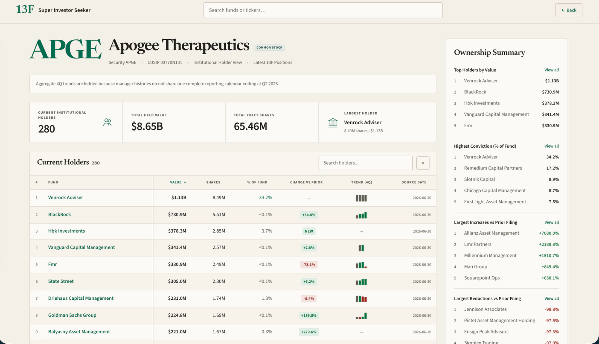
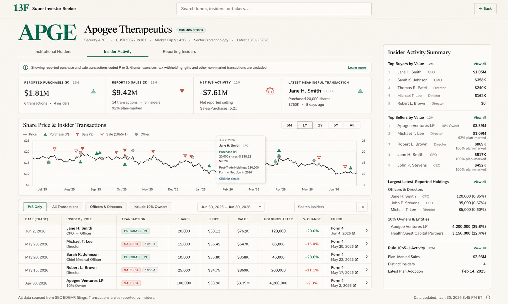

# 13F Super Investor Seeker — Insider Activity

## Product Requirements Document and Codex Implementation Specification

**Version:** 1.0  
**Status:** Build-ready specification  
**Prepared for:** Wesley / 13f.wesleyyon.com  
**Prepared on:** August 14, 2026  
**Primary audience:** Codex or another coding agent working inside the existing 13F Super Investor Seeker repository  
**Reference mockup:** `reference/insider-activity-mockup.png`  
**Reference current page:** `reference/current-holder-page.png`

> **Implementation priority:** Preserve the existing application architecture, data model conventions, routing conventions, design system, and deployment workflow. This PRD describes the desired behavior and appearance. It is not permission to replace the current stack or rebuild the application from scratch.

## Current production privacy and topology override

This controlling override supersedes conflicting historical public drawer,
database, and API requirements in this PRD. Current production uses a screened
static payload, not a public database or API topology. The SEC source link is
the complete-record path. Public payloads exclude owner CIKs,
addresses/contact information, full footnotes, remarks, raw narratives,
stable/private correlators, and private provenance. All are excluded from public
payloads and public logs. Historical parser, private-storage, and
source-preservation requirements remain private and are not rewritten by this
override.

---

## 1. Executive summary

Add a first-class **Insider Activity** experience to each public-company security page in the existing 13F filing tracker. The new experience should ingest, normalize, analyze, and display SEC Forms 3, 4, 5, and their amendments while fitting naturally into the site's current visual language.

The page should look like a parallel sibling of the existing **Institutional Holders** page, not a separate product. It should reuse the same shell, company identity area, card styling, typography, spacing, border treatment, color palette, table density, and right-rail summary pattern.

The product must deliberately distinguish economically meaningful open-market/private purchases and sales from compensation-related or administrative transactions. The default analytical view should include only transaction codes **P** and **S**. Awards, exercises, tax withholding, gifts, conversions, and other codes remain accessible through filters and filing details but must not pollute headline purchase/sale metrics.

The feature consists of:

1. A new **Insider Activity** tab on each security page.
2. A new **Reporting Insiders** tab or subview that lists reporting owners associated with the issuer.
3. A four-card summary row.
4. A price chart with insider-transaction markers.
5. A filterable, sortable transaction table.
6. A filing-detail drawer with complete SEC provenance and footnotes.
7. An **Insider Activity Summary** right rail.
8. A reliable ingestion and normalization pipeline for Section 16 ownership filings.
9. Clear handling of amendments, joint filers, indirect ownership, derivative transactions, missing prices, weighted-average prices, and Rule 10b5-1 flags.
10. A small cross-link from the existing institutional-holder view into the new insider view.

The reference image is the visual target. The PRD below defines the exact product behavior required to make that visual target accurate, generalizable, and production-safe.

---

## 2. Product context

### 2.1 Current product

The current application is a personal 13F filing tracker centered on institutional manager holdings. A company security page currently contains:

- Global brand/header and search.
- A security identity header with ticker, company name, security metadata, and view description.
- A contextual data-quality banner.
- Four summary cards.
- A large current-holder table.
- A narrow right rail containing ranked ownership summaries.
- A warm, editorial visual theme with ivory backgrounds, restrained forest-green accents, subtle taupe borders, serif display typography, and compact sans-serif data labels.

The new insider feature should preserve this information architecture and visual hierarchy.

### 2.2 Why insider activity belongs in this product

Institutional ownership and insider ownership are complementary sources of public ownership information:

- Form 13F shows delayed institutional positions at calendar-quarter end.
- Forms 3, 4, and 5 show initial ownership, changes in beneficial ownership, and certain deferred reports by directors, officers, and greater-than-10% holders.
- Insider filings are more timely than 13F filings but contain materially more transaction-code nuance and ownership-structure complexity.

The value of this implementation is not merely reproducing raw Form 4 tables. The product should make the signal legible while preserving the underlying filing detail and avoiding overstatement.

### 2.3 Product principle

> **Make the economically relevant activity obvious without hiding the filing complexity that determines whether the interpretation is valid.**

---

## 3. Goals

### 3.1 Primary goals

1. **Visual continuity**  
   Make the insider page feel native to the current website.

2. **Signal-first default**  
   Default to open-market/private purchase and sale codes P and S.

3. **Source transparency**  
   Every displayed transaction must be traceable to its SEC accession, filing, raw transaction row, and applicable footnotes.

4. **Accurate aggregation**  
   Prevent double counting across amendments, joint filers, multiple filing rows, and indirect ownership structures.

5. **Fast company research**  
   Allow a user to understand recent insider activity, its size, who acted, whether a sale was plan-marked, and how the stock traded around the activity in under 30 seconds.

6. **Reusable infrastructure**  
   Build data models and APIs that can support a later market-wide screener, alerts, and individual insider profile pages.

7. **Defensive interpretation**  
   Clearly distinguish reported facts from calculated fields and calculated fields from inferred classifications.

### 3.2 Success criteria

The feature is successful when:

- A user can navigate from a ticker's institutional-holder page to insider activity without leaving the security context.
- The default screen shows only meaningful P/S activity in metrics and chart markers.
- Clicking any table row reveals complete filing-level detail and source links.
- The page remains understandable when there are no purchases, only grants, only derivative transactions, multiple joint filers, or amended filings.
- The page visually matches the reference image at desktop widths and remains usable at tablet widths.
- Re-running ingestion is idempotent and does not create duplicate filings or transactions.
- All aggregate values can be recomputed from normalized source rows.

---

## 4. Non-goals for the first release

The MVP should **not** attempt to do the following:

1. Produce a proprietary bullish/bearish score.
2. Label all insider sales as negative or all purchases as predictive.
3. Present a definitive company-wide total insider-ownership percentage.
4. Infer the motivation behind a transaction.
5. Infer Rule 10b5-1 status when the structured filing flag is absent or ambiguous.
6. File forms with the SEC or interact with EDGAR filer accounts.
7. Build a full market-wide insider screener in the first release.
8. Build email, SMS, or push alerts in the first release.
9. Treat Form 144 planned sales as completed sales. Form 144 may be added later as a distinct planned-sale module.
10. Replace the existing security page, search experience, price provider, database, ORM, charting library, or frontend framework unless the existing repository has no corresponding capability.
11. Add investment advice, trade recommendations, or expected-return claims.
12. Normalize every historical security class into one economic exposure without issuer-specific review.

---

## 5. Target users and core jobs

### 5.1 Primary user

A financially sophisticated public-equity researcher who wants a fast, source-grounded view of ownership changes.

### 5.2 Core jobs to be done

- Determine whether officers or directors have purchased stock recently.
- Determine whether sales are isolated, recurring, or plan-marked.
- Compare transaction value with the insider's reported post-transaction holdings.
- Separate management activity from venture-fund or other 10% owner activity.
- Understand whether the apparent transaction was a grant, exercise, tax withholding, gift, conversion, or actual purchase/sale.
- Open the underlying filing and footnotes without re-running an EDGAR search.
- Place insider activity in the context of price performance and institutional accumulation/reduction.

### 5.3 Representative user stories

1. As a researcher, I want the page to default to P/S transactions so awards and tax withholding do not overwhelm the signal.
2. As a researcher, I want to exclude 10% owners so I can focus on management and directors.
3. As a researcher, I want to see whether a sale filing is marked under Rule 10b5-1.
4. As a researcher, I want the raw transaction code beside a human-readable label.
5. As a researcher, I want to see direct versus indirect ownership and the stated nature of indirect ownership.
6. As a researcher, I want to know whether a filing is amended or late.
7. As a researcher, I want a price chart with transaction markers and a detailed hover state.
8. As a researcher, I want a row click to show all transaction lines and footnotes in the same filing.
9. As a researcher, I want transactions in a joint filing counted once, not once per reporting owner.
10. As a researcher, I want missing prices displayed as missing rather than interpreted as zero.

---

## 6. Release scope and prioritization

### 6.1 P0 — required MVP

- Security-page navigation tabs.
- Insider Activity page shell.
- SEC Forms 3, 4, 5, 3/A, 4/A, and 5/A ingestion.
- Non-derivative and derivative transaction parsing.
- Reporting-owner relationship parsing.
- Filing-level Rule 10b5-1 flag parsing.
- Footnote parsing and field-level links.
- P/S-only default metrics, chart, and table.
- Four summary cards.
- Share-price and insider-transaction chart.
- Filter bar.
- Sortable, paginated transaction table.
- Filing-detail drawer.
- Right-rail summary blocks.
- Loading, empty, error, and stale-data states.
- Desktop and tablet layouts.
- Unit, integration, parser, metric, and visual-regression tests.
- Existing institutional-holder page cross-link.

### 6.2 P1 — recommended immediately after MVP

- Reporting Insiders tab.
- Insider profile routes.
- Market-wide recent-activity feed.
- Cluster-purchase detection.
- Saved filter presets.
- Watchlist-based alerts.
- Historical post-transaction performance calculations.
- Form 144 planned-sale notices as a separate dataset.
- 10-K/10-Q Item 408 trading-plan adoption/modification/termination extraction.

### 6.3 P2 — later opportunities

- Combined 13F + insider screens.
- Cross-company insider history.
- Insider network/entity resolution.
- Plan-execution monitoring.
- Aggregate ownership reconstruction with overlap/confidence modeling.
- Research notes and annotations.

---

## 7. Information architecture

### 7.1 Security-page tabs

Add a visible tab row below the company metadata:

- **Institutional Holders**
- **Insider Activity**
- **Reporting Insiders**

The active tab uses the site's existing green accent and underline treatment.

### 7.2 Routing

Adapt to the repository's current route scheme. Do not invent a parallel security route if one already exists.

Preferred logical routes:

```text
/security/:ticker/holders
/security/:ticker/insiders
/security/:ticker/reporting-insiders
```

Acceptable alternative when the app uses one security route:

```text
/security/:ticker?view=holders
/security/:ticker?view=insiders
/security/:ticker?view=reporting-insiders
```

The chosen route must support deep links and preserve filter state in query parameters.

### 7.3 Recommended query parameters

```text
range=1y
transactionScope=ps|all
ownerScope=officers-directors|all|ten-percent
securityScope=primary-common|all
plan=all|10b5-1|not-10b5-1
start=YYYY-MM-DD
end=YYYY-MM-DD
search=<owner name>
sort=tradeDate|value|shares|holdingsAfter|percentChange
order=asc|desc
cursor=<opaque cursor>
```

Do not expose database IDs in the URL when an accession number, ticker, CIK, or stable public identifier is available.

### 7.4 Global search

Update the placeholder to:

> Search funds, insiders, or tickers…

MVP behavior may continue to return only funds and tickers if insider-profile pages are deferred, but the UI and search abstraction should be able to add reporting-owner results without another header redesign.

---

## 8. Reference assets and visual authority

The implementation package contains two images:

1. `reference/current-holder-page.png` — current production visual language.
2. `reference/insider-activity-mockup.png` — desired insider page.

The mockup is the authority for:

- Overall layout.
- Relative component sizing.
- Density.
- Hierarchy.
- Border and card treatment.
- Chart placement.
- Sidebar proportions.
- Table column ordering.

The current production screenshot is the authority for:



The desired insider page is shown below:



- Existing brand treatment.
- Exact fonts already loaded.
- Existing design tokens.
- Existing header behavior.
- Existing responsive shell.
- Existing icon style.

If the mockup conflicts with an established production component, preserve the production component and modify it only as needed to accommodate the insider-specific content.

---

## 9. Desktop layout specification

### 9.1 Overall canvas

The reference mockup is 1621 × 970 pixels. Implement responsively rather than hardcoding this viewport.

Recommended shell:

```css
.page-shell {
  width: min(1510px, calc(100vw - 32px));
  margin-inline: auto;
}

.security-layout {
  display: grid;
  grid-template-columns: minmax(0, 1fr) 342px;
  gap: 36px;
  align-items: start;
}
```

At a 1621-pixel viewport, this yields approximately 55-pixel outer margins, a 1,132-pixel main column, a 342-pixel right rail, and a 36-pixel gutter.

### 9.2 Vertical anatomy

Approximate desktop heights from top to bottom:

| Region | Approximate height |
|---|---:|
| Global header | 58 px |
| Company identity row | 82 px |
| Tab row | 39 px |
| Context banner | 36 px |
| Gap | 12 px |
| KPI card row | 116 px |
| Gap | 14 px |
| Chart card | 244 px |
| Gap | 12 px |
| Filter bar | 50 px |
| Table header | 31 px |
| Table row | 41–45 px |
| Footer/meta row | 42 px |

These are targets, not immutable constants. Match the current site's actual spacing scale where possible.

### 9.3 Main/right-rail alignment

- The right rail begins level with the KPI region in the mockup.
- It may begin immediately below the tabs or banner if that better matches the existing page shell.
- The right rail remains one continuous card with internal section dividers.
- The right rail should not have independent scroll unless the full page itself is constrained by a fixed-height shell, which is not recommended.

---

## 10. Visual design system

### 10.1 General rule

Reuse current CSS variables and components. Only introduce new variables when the existing design system lacks an equivalent.

### 10.2 Approximate color tokens

These values are inferred from the screenshots and should be reconciled with existing tokens.

```css
:root {
  --page-bg: #f8f5f0;
  --surface: #fffefb;
  --surface-subtle: #fcfaf7;
  --text-primary: #1d1e1c;
  --text-secondary: #666a65;
  --text-tertiary: #8a8d88;
  --brand-green: #00694b;
  --brand-green-dark: #00553d;
  --brand-green-mid: #3d836e;
  --brand-green-soft: #e7f1ed;
  --brand-green-border: #b8d8cc;
  --sale-red: #c86452;
  --sale-red-dark: #a94e40;
  --sale-red-soft: #fae9e5;
  --sale-red-border: #edc5bd;
  --neutral-badge: #f0efeb;
  --neutral-marker: #989b97;
  --border: #d8d2c9;
  --border-subtle: #e7e2da;
  --gridline: #e7e3dc;
  --focus-ring: #2f8066;
}
```

Do not introduce saturated trading-terminal colors. Purchases and sales should remain muted and editorial.

### 10.3 Typography

Use the exact fonts already loaded by the site.

If the repository has no formal type tokens, use these fallbacks:

```css
--font-display: Georgia, "Times New Roman", serif;
--font-ui: Inter, ui-sans-serif, -apple-system, BlinkMacSystemFont, "Segoe UI", sans-serif;
```

Target sizes:

| Element | Size | Weight / treatment |
|---|---:|---|
| Ticker display | 62–68 px | Display serif, regular |
| Company name | 30–34 px | Display serif, semibold |
| Page section heading | 19–21 px | Display serif, semibold |
| Sidebar title | 19–21 px | Display serif, semibold |
| KPI label | 10–11 px | UI font, 600, uppercase, letter-spacing 0.07em |
| KPI value | 25–29 px | UI font, 500–600 |
| Metadata | 11–12 px | UI font, regular |
| Table header | 9.5–10.5 px | UI font, 600, uppercase, letter-spacing 0.06em |
| Table body | 11.5–12.5 px | UI font, regular |
| Insider name | 12–13 px | UI font, 600 |

Use tabular numerals for financial values.

### 10.4 Borders, radii, and shadows

- Standard card border: 1 px solid `var(--border)`.
- Standard card radius: 6 px.
- Badge radius: 4 px.
- Button radius: 4–5 px.
- Shadows: none by default.
- Tooltip/drawer may use a subtle shadow, no stronger than `0 6px 20px rgba(25, 30, 27, 0.12)`.

### 10.5 Spacing

Use the existing spacing scale. Approximate target scale:

```text
4, 6, 8, 12, 16, 20, 24, 32, 36, 48 px
```

### 10.6 Icons

Use the icon library already present in the repo. Do not introduce a second icon family.

Required icon concepts:

- Info circle.
- Purchase/up triangle.
- Sale/down triangle.
- Scale/balance for net activity.
- External link.
- Chevron right.
- Close.
- Search.
- Optional filing/document icon.

All decorative icons must be hidden from screen readers. Interactive icons require labels.

---

## 11. Page component specification

## 11.1 Global header

Reuse the current global header exactly, with one text change:

```text
Search funds, insiders, or tickers…
```

The Back button remains in the upper-right position.

### Acceptance requirements

- Search width and alignment match the production page.
- Search remains keyboard accessible.
- Existing search result behavior is unchanged unless expanded intentionally.
- Back behavior uses navigation history when safe and falls back to the security-list route.

---

## 11.2 Security identity header

### Required content

- Large ticker symbol.
- Company legal/display name.
- Security-type badge, e.g. `COMMON STOCK`.
- Security ticker.
- CUSIP, if available from the existing app.
- Market capitalization, if already supported.
- Sector/industry, if already supported.
- Latest available 13F period.

Example:

```text
APGE  Apogee Therapeutics  [COMMON STOCK]
Security APGE · CUSIP 03770N101 · Market Cap $1.42B · Sector Biotechnology · Latest 13F Q2 2026
```

### Rules

- Insider data is keyed primarily by issuer CIK and security identity, not ticker alone.
- Ticker changes must not break historical insider data.
- A ticker in the header is the current ticker; transaction rows preserve the issuer symbol as filed when needed in detail views.

---

## 11.3 Tab row

Tabs:

```text
Institutional Holders | Insider Activity | Reporting Insiders
```

### Interaction

- Active tab has green text and a 2-pixel green underline.
- Hover uses a subtle green tint, not a filled pill.
- Focus state is visible.
- Tab click changes route and is reflected in browser history.
- Filters should persist only within the insider view unless the user returns using browser history.

---

## 11.4 Context banner

### Default copy

> Showing reported purchase and sale transactions coded P or S. Grants, exercises, tax withholding, gifts and other non-market transactions are excluded.

Right-side action:

> Learn more

### Behavior

- `Learn more` opens a compact methodology modal or drawer.
- The banner may become dynamic when there is a material state worth communicating.

Examples:

```text
Three officers or directors reported purchases totaling $1.2M during the past 30 days.
```

```text
No officers or directors have reported a P-coded purchase during the past 12 months.
```

```text
Insider filings are available, but no P/S transactions were reported in the selected period. Switch to All Transactions to view grants, exercises, and other activity.
```

### Methodology content

The methodology disclosure should explain:

- P and S are the only codes in headline purchase/sale totals.
- Missing prices are excluded from dollar-value totals.
- Rule 10b5-1 is a filing-level structured flag unless transaction-specific mapping is clearly stated in a footnote.
- Latest-reported holdings are not a definitive current ownership calculation.
- The SEC filing is the authoritative source.

---

## 11.5 Four summary cards

The row is one bordered container divided into four equal or near-equal cells.

### Card 1 — Reported Purchases (P), 12M

Primary value:

```text
$1.81M
```

Secondary line:

```text
6 transactions · 4 insiders
```

Icon:

- Filled upward triangle in muted green.

Calculation:

- Include only normalized transactions with code P.
- Include both non-derivative and derivative P transactions only when the value can be calculated reliably.
- Count grouped economic transactions, not duplicated owners in a joint filing.
- Exclude superseded filing versions.
- Exclude rows with missing value from the dollar sum but include them in a separately tracked incomplete-value count.
- If any rows are omitted from value due to missing price/value, show an info tooltip:

```text
2 additional purchase transactions have no reportable transaction value and are excluded from the dollar total.
```

### Card 2 — Reported Sales (S), 12M

Primary value:

```text
$9.42M
```

Secondary lines:

```text
14 transactions · 5 insiders
92% plan-marked
```

Icon:

- Filled downward triangle in muted coral.

Plan-marked percentage:

```text
sum(value of S transactions in filings where aff10b5One = true)
/
sum(value of all S transactions where value is available and aff10b5One is not null)
```

Do not treat `null` as `false`. When the denominator is unavailable, hide the percentage or show `Plan status unavailable`.

### Card 3 — Net P/S Activity, 12M

Primary value:

```text
-$7.61M
```

Secondary lines:

```text
Net reported selling
Sales/Purchases: 5.2x
```

Icon:

- Balance/scale icon in green or neutral accent.

Calculation:

```text
purchaseValue - saleValue
```

Rules:

- Net activity is descriptive, not a sentiment score.
- When purchase value is zero, do not display infinity. Show `Purchases: $0` or `Sales only`.
- When both values are zero, show `No valued P/S activity`.

### Card 4 — Latest Meaningful Transaction

Display:

- Owner/group display name.
- Role badge.
- Human-readable transaction sentence.
- Value, if available.
- Relative filing/trade recency.
- Purchase or sale icon.

Example:

```text
Jane H. Smith  [CFO]
Purchased 20,000 shares
$760K · 8 days ago
```

Selection logic:

1. Filter to non-superseded P/S activity.
2. Sort by transaction date descending.
3. Tie-break by accepted timestamp descending.
4. Group multiple same-filing rows that represent one displayed economic event.
5. If no P/S transaction exists, show `No P/S transactions in the past 12 months` and link to All Transactions.

---

## 11.6 Share Price & Insider Transactions chart

### Purpose

Show the relationship between daily stock price and reported insider transactions without implying causality.

### Card layout

- Full-width card in the main column.
- Header left: `Share Price & Insider Transactions`.
- Time-range controls right: `6M`, `1Y`, `2Y`, `5Y`, `All`.
- Legend below title.
- Chart plot area beneath legend.

### Default state

- Default range: 1Y.
- Default transaction scope: P/S only.
- Default owner scope: all owners, subject to global filters.
- Default security scope: issuer's primary common-equity security.

### Price series

- Use daily unadjusted close when raw reported transaction prices are plotted.
- If the existing provider only supplies split-adjusted prices, either:
  1. Apply the same split adjustment to transaction prices/shares for display, while retaining raw values in the tooltip; or
  2. Use unadjusted price data for this chart.
- Do not overlay raw transaction prices on an adjusted price line after a stock split without correction.
- Use a thin charcoal line.
- Do not use area fill.
- Gridlines should be sparse and light.

### Transaction markers

| Type | Marker | Fill/stroke |
|---|---|---|
| Purchase P | Up triangle | Filled green |
| Sale S, not plan-marked | Down triangle | Filled coral |
| Sale S, filing plan-marked | Down triangle | White/transparent fill, coral stroke |
| Other transaction | Circle | Neutral gray |

Marker behavior:

- Marker size scales logarithmically with absolute transaction value.
- Apply minimum and maximum marker sizes so outliers do not dominate.
- Missing-value transactions use the minimum marker size.
- Multiple transactions on the same day may be horizontally jittered by a few pixels or stacked with a count badge.
- The marker's vertical coordinate should be the transaction price when available; otherwise use the daily close and indicate that placement is approximate.
- Do not aggregate purchases and sales into one net marker.

### Suggested marker-size formula

```text
radius = clamp(4, 4 + 2.4 * log10(max(value, 1) / 10,000 + 1), 11)
```

Adapt to the chosen chart library.

### Legend

```text
— Price   ▲ Purchase (P)   ▼ Sale (S)   ▽ Sale (10b5-1)   ● Other
```

When P/S Only is active, `Other` may remain in the legend only if the user can toggle it from the chart. Otherwise hide it.

### Tooltip

The tooltip should include:

- Transaction date.
- Owner/group name.
- Role.
- Transaction label and raw code.
- Shares.
- Price per share, with `reported weighted average` if indicated by footnote classification.
- Calculated/reported transaction value.
- Post-transaction holdings.
- Filing form and filing date.
- Rule 10b5-1 filing flag.
- Direct/indirect ownership.
- Link-like action: `Click for details`.

Example:

```text
Jun 2, 2026
Jane H. Smith — CFO
Purchase (P)
20,000 shares @ $38.12
$762K
Post-Trade Holdings: 120,000
Form 4 filed Jun 4, 2026
Click for details
```

### Accessibility

- Provide an adjacent visually hidden description of the chart.
- Each marker should be keyboard reachable when technically feasible.
- Provide an accessible transaction table as the canonical text alternative.
- Do not rely on color alone; marker shape must communicate type.

### Performance

- Lazy-load the chart library if it is a substantial bundle.
- Downsample price data only when necessary, never transaction events.
- Cache price series by ticker/range.

---

## 11.7 Filter and search bar

The filter bar sits directly above the transaction table.

### Required controls

1. **P/S Only** — selected by default.
2. **All Transactions**.
3. **Officers & Directors**.
4. **Include 10% Owners**.
5. Date-range selector.
6. Insider-name search input.
7. Clear-search button.

### Recommended expanded filters

These may be placed in an overflow/popover:

- Purchase only.
- Sale only.
- 10b5-1 only.
- Exclude 10b5-1.
- Direct ownership only.
- Indirect ownership only.
- Non-derivative only.
- Derivative only.
- Security class.
- Minimum transaction value.
- Form type.
- Late filings.
- Amended filings.

### Interaction rules

- Filter state must sync to URL parameters.
- Changing filters updates summary cards, chart markers, right rail, and table consistently.
- Search is debounced by approximately 200–300 ms.
- Date range defaults to the chart range but may be independently set through explicit start/end dates.
- `Officers & Directors` excludes filings where the only relationship is 10% owner or Other.
- `Include 10% Owners` is additive; it should not hide officers/directors who are also 10% owners.
- The current filter count should be visible in an overflow button when hidden filters are active.

---

## 11.8 Transaction table

### Default ordering

- Transaction date descending.
- Accepted timestamp descending.
- Source row order ascending within a filing.

### Required columns

| Column | Description |
|---|---|
| Date (Trade) | Actual transaction date; never substitute filing date |
| Insider / Role | Owner-group display, title, and relationship |
| Transaction | Human label, raw code, and badges |
| Shares | Absolute reported shares for the row/group |
| Price | Reported price per share, weighted-average indicator if applicable |
| Value | Reported or calculated transaction value |
| Holdings After | Post-transaction holdings for the relevant ownership bucket |
| % Change | Calculated only when reliable |
| Filing | Form, filing date, source action, row chevron |

### Column behavior

#### Date (Trade)

- Format: `Jun 2, 2026` on desktop.
- Tooltip shows deemed execution date if present.
- Optional late badge when `transactionTimeliness = L`.

#### Insider / Role

Single owner:

```text
Jane H. Smith
CFO · Officer
```

Joint filing:

```text
Jane H. Smith + 2
Joint filing · CFO / 10% Owner
```

Clicking the owner area opens the filing drawer in MVP. In P1 it may link to an insider profile.

#### Transaction

Badges:

- `PURCHASE (P)`
- `SALE (S)`
- `AWARD (A)`
- `EXERCISE (M)`
- `TAX WITHHOLDING (F)`
- `GIFT (G)`
- `CONVERSION (C)`
- `OTHER (J)`
- Additional codes as defined in the mapping appendix.

Secondary badges:

- `10b5-1`
- `AMENDED`
- `LATE`
- `DERIVATIVE`
- `INDIRECT`
- `JOINT`

#### Shares

- Use absolute shares in the column.
- Acquisition/disposition is communicated by the transaction badge and stored sign.
- Use compact formatting only at very large values; allow exact value in tooltip.

#### Price

- Display `$38.12` when available.
- Display `—` with tooltip `Price not reported` when unavailable.
- Display an info indicator for weighted-average pricing.
- Never display a missing price as `$0.00`.

#### Value

Value-source priority:

1. Explicit reported total value when present and semantically appropriate.
2. `shares × price per share` for non-derivative P/S rows.
3. `shares × price per share` for derivative P/S rows when the price represents the transacted derivative security and the calculation is appropriate.
4. Otherwise null.

Every value must carry an internal `valueMethod` enum:

```text
reported_total
calculated_shares_times_price
unavailable
not_applicable
```

Tooltip example:

```text
Calculated as 20,000 reported shares × $38.12 reported price per share.
```

#### Holdings After

- Use the post-transaction shares reported for the same security and ownership bucket.
- Show `—` when absent.
- Tooltip shows direct/indirect ownership and nature of ownership.

#### % Change

Compute only when all conditions are satisfied:

1. Post-transaction holdings are present.
2. Transaction shares are present.
3. Acquisition/disposition code is present.
4. Transaction and holdings refer to the same normalized security and ownership bucket.
5. The filing does not contain multiple rows whose repeated final holdings make row-level reconstruction ambiguous.

Formula:

```text
signedDelta = shares for A; -shares for D
priorHoldings = postHoldings - signedDelta
percentChange = signedDelta / abs(priorHoldings)
```

Special states:

- If `priorHoldings = 0` and acquisition > 0, display `NEW`.
- If calculation is ambiguous, display `—`, not a guessed value.
- Do not calculate percent change for grants/exercises if the product is using a P/S-only analytical interpretation; the raw row may still be shown in All Transactions.

#### Filing

Display:

```text
Form 4
Jun 4, 2026 ↗   ›
```

- External-link icon opens the official SEC filing in a new tab.
- Chevron or row click opens the internal detail drawer.
- Include an accessible label such as `Open SEC Form 4 filed June 4, 2026`.

### Row grouping

The product must distinguish a raw SEC row from an economic display group.

Recommended approach:

- Store every raw transaction row independently.
- Generate a `displayGroupKey` for rows sharing:
  - filing,
  - reporting-owner group,
  - transaction date,
  - normalized security,
  - transaction code,
  - acquired/disposed code,
  - direct/indirect ownership,
  - nature-of-ownership bucket.
- Keep rows separate when different prices or footnotes materially change interpretation.
- The chart may aggregate a display group into one marker.
- The table may show either raw rows or a collapsed group. If collapsed, the row must expand to show every source row.

### Pagination

- Use cursor-based pagination if supported by the backend.
- Default page size: 25.
- Optional sizes: 25, 50, 100.
- Preserve scroll position when closing the detail drawer.

### Sticky behavior

- Table header may become sticky within the document when the table is long.
- Do not make the entire table body independently scroll on desktop unless the current site already uses that pattern.

---

## 11.9 Filing-detail drawer

### Trigger

- Click anywhere on the table row except the external SEC link.
- Click a chart marker.
- Keyboard activation via Enter/Space.

### Drawer behavior

- Desktop: right-side drawer, approximately 520–620 px wide.
- Tablet/mobile: full-screen sheet.
- URL should optionally include `filing=<accession>` so the drawer can be deep-linked.
- Closing restores focus to the triggering element.

### Drawer sections

1. **Header**
   - Form type.
   - Filing date and accepted timestamp.
   - Transaction date/period of report.
   - Accession number.
   - Amendment/late/10b5-1 badges.
   - SEC source button.

2. **Reporting owners**
   - Every owner in the joint filing.
   - Owner CIK.
   - Director/officer/10% owner/other flags.
   - Officer title.

3. **Transaction lines**
   - Table I non-derivative rows.
   - Table II derivative rows.
   - Raw code and normalized label.
   - Shares, price, value, acquired/disposed, post holdings.
   - Direct/indirect ownership.
   - Nature of ownership.

4. **Derivative details**
   - Derivative title.
   - Conversion/exercise price.
   - Exercise date.
   - Expiration date.
   - Underlying security title.
   - Underlying shares/value.

5. **Footnotes**
   - Preserve original numbering.
   - Show each footnote once.
   - Indicate which field(s) reference each footnote.
   - Preserve line breaks.
   - Sanitize all markup.

6. **Remarks**
   - Display filing remarks exactly as text, after sanitization.

7. **Amendment history**
   - Show linked original and later amendments when confidently matched.
   - Explain which version is used in aggregates.
   - If matching is uncertain, state that the amendment chain could not be resolved automatically.

8. **Data lineage**
   - Source document URL.
   - Source index URL.
   - Parser version.
   - Ingested timestamp.
   - Last reprocessed timestamp.

### Important wording

When `aff10b5One = true`, label:

> Filing marked Rule 10b5-1

Do not claim every row was executed under the plan unless the structured filing or footnotes support row-level attribution.

---

## 11.10 Insider Activity Summary right rail

The right rail is one bordered card with four vertically stacked sections.

### Section 1 — Top Buyers by Value, 12M

Rank by aggregate P-coded transaction value.

Each row:

```text
1  Jane H. Smith  CFO  $1.05M
```

Rules:

- Aggregate by reporting-owner group to avoid double counting joint filers.
- Show up to five entries.
- Missing-value purchases do not contribute to ranking value.
- `View all` opens a modal, drawer, or sorted table state.

### Section 2 — Top Sellers by Value, 12M

Each row may have a second line:

```text
Michael T. Lee   Director      $1.09M
                               92% plan-marked
```

Rules:

- Aggregate by reporting-owner group.
- Plan-marked percentage uses valued S transactions with known plan status.
- Use `Unknown` when plan status is unavailable, not 0%.

### Section 3 — Largest Latest-Reported Holdings

Subsections:

```text
Officers & Directors
10% Owners & Entities
```

Display latest-reported primary common-equity holdings by owner/group.

Example:

```text
Jane H. Smith   CFO       120,000 (0.85%)
Apogee Ventures LP         4,200,000 (29.8%)
```

Rules:

- The share count is based on the latest available reported position by ownership bucket.
- Percentage of shares outstanding is optional and must be hidden when the denominator is unavailable or stale.
- If shown, tooltip states the denominator date and source.
- Do not sum these rows into a company total because ownership may overlap across reporting persons and entities.
- Label section as `Latest-Reported Holdings`, not `Current Holdings`.

### Section 4 — Rule 10b5-1 Activity, 12M

Required metrics:

- Plan-marked sales value.
- Distinct reporting-owner groups.
- Latest disclosed plan-adoption date, if extracted reliably from structured data or footnotes.

MVP may omit the plan-adoption date if not available through a reliable parser. Never infer it from the filing date.

---

## 11.11 Footer and data freshness

Left:

```text
All data sourced from SEC EDGAR filings. Transactions are as reported by insiders.
```

Right:

```text
Data updated: Jun 30, 2026 8:45 PM ET  ⓘ
```

The info control should expose:

- Latest successful SEC sync.
- Latest parsed filing acceptance time.
- Price-data freshness.
- Whether any ingestion errors remain unresolved.

Use Eastern Time for SEC-related timestamps in the UI unless the existing site has a different global convention. Store timestamps in UTC.

---

## 12. Responsive behavior

### 12.1 Breakpoints

Use existing breakpoints where available. Recommended behavior:

#### ≥ 1280 px

- Two-column main + 342-pixel right rail.
- Four KPI cards in one row.
- Full table columns.

#### 1024–1279 px

- Two-column layout may remain if the right rail can stay at 300–320 px.
- Otherwise move right rail below the main content.
- Preserve chart height.
- Allow table horizontal scroll.

#### 768–1023 px

- Single-column layout.
- KPI cards in 2 × 2 grid.
- Right rail below table or as collapsible sections.
- Filter buttons wrap.
- Table uses horizontal scroll with sticky first column if supported.

#### < 768 px

- Single column.
- Ticker and company name stack.
- KPI cards stack or 2 × 2 depending on width.
- Chart controls become a compact select or horizontally scrollable segmented control.
- Table converts to a compact transaction list or remains horizontally scrollable.
- Filing detail becomes full screen.

### 12.2 Mobile priority

Mobile is required to be usable but desktop visual parity is the primary MVP target. Do not delay data correctness or desktop completion to build a highly customized mobile card system.

---

## 13. Accessibility requirements

Meet WCAG 2.2 AA where practical within the existing application.

Required:

- Keyboard access to tabs, filters, rows, chart markers where supported, drawer, and links.
- Visible focus indicators.
- Semantic heading hierarchy.
- Real buttons for interactive controls.
- Proper table semantics with column headers.
- Screen-reader labels for icons and abbreviations.
- Sufficient contrast for muted green/red badges.
- Purchase/sale meaning communicated by shape and text, not color alone.
- Drawer focus trap and focus restoration.
- Escape closes drawer/modal.
- Reduced-motion preference respected.
- Tooltip content available by keyboard/focus, not hover only.
- Chart has a text alternative through the transaction table.

---

## 14. SEC data scope and source strategy

### 14.1 Included forms

- Form 3.
- Form 3/A.
- Form 4.
- Form 4/A.
- Form 5.
- Form 5/A.

### 14.2 Source-of-truth hierarchy

1. **Raw ownership XML filing document** — authoritative for current ingestion and complete field/footnote relationships.
2. **SEC filing index and submission metadata** — authoritative for acceptance time, accession, and document URLs.
3. **SEC quarterly Insider Transactions datasets** — efficient historical backfill and reconciliation from January 2006 onward.
4. **Application-normalized database** — product query layer.
5. **Derived aggregates/cache** — performance layer, always reproducible from normalized rows.

### 14.3 Current/incremental ingestion

Preferred architecture:

1. Discover new Forms 3/4/5 and amendments through the SEC daily/current filing feed or index mechanism already used by the project.
2. Fetch each filing's index metadata.
3. Identify and fetch the ownership XML primary document.
4. Parse and validate XML server-side.
5. Upsert filing, owners, transaction rows, holdings rows, footnotes, signatures, and source metadata.
6. Recompute amendment relationships and issuer-level aggregates.
7. Invalidate/cache-refresh affected security pages.

Do not fetch SEC XML directly from the browser. `data.sec.gov` does not support browser CORS for this use case, and all SEC traffic should be centralized and rate-limited server-side.

### 14.4 Historical backfill

Use quarterly SEC Insider Transactions dataset ZIP files for bulk history where practical. The dataset contains up to eight logical tables:

- SUBMISSION.
- REPORTINGOWNER.
- NONDERIV_TRANS.
- NONDERIV_HOLDING.
- DERIV_TRANS.
- DERIV_HOLDING.
- FOOTNOTES.
- OWNER_SIGNATURE.

Backfill process:

1. Download each quarter once.
2. Verify checksum or file size if the project supports it.
3. Parse tab-delimited UTF-8 files.
4. Normalize into the application schema.
5. Store quarter/source version.
6. Reconcile with raw-XML ingested filings by accession number.
7. Prefer raw XML when there is a difference because field-level footnote links and newer schema elements may be more complete.

### 14.5 SEC fair-access requirements

All automated requests must:

- Use a declared User-Agent containing application identity and a monitored contact email.
- Use gzip/deflate where supported.
- Stay comfortably below the SEC's current maximum of 10 requests per second.
- Implement a shared process-wide rate limiter, not one limiter per worker.
- Cache immutable filing documents indefinitely.
- Retry 429/5xx responses with exponential backoff and jitter.
- Avoid re-downloading documents that are already stored and verified.

Recommended default operational limit:

```text
5 requests/second sustained, burst no greater than 8, globally across all workers.
```

Environment variables:

```text
SEC_USER_AGENT="13F Super Investor Seeker admin@your-domain.com"
SEC_MAX_REQUESTS_PER_SECOND=5
SEC_REQUEST_TIMEOUT_MS=20000
SEC_RETRY_LIMIT=5
```

Do not commit a personal email address to source control; configure it in deployment secrets.

---

## 15. Ownership XML parsing requirements

### 15.1 Parser design

- Use a mature XML parser with external entities disabled.
- Treat schema versions as data; do not assume one fixed schema.
- Preserve raw XML for reproducibility, subject to storage policy.
- Normalize booleans expressed as `0/1` or `true/false`.
- Preserve unknown elements in raw data and emit parser telemetry.
- Parser must be deterministic and idempotent.

### 15.2 Top-level fields

At minimum parse:

- schemaVersion.
- documentType.
- periodOfReport.
- dateOfOriginalSubmission, when present.
- notSubjectToSection16.
- noSecuritiesOwned.
- form3HoldingsReported.
- form4TransactionsReported.
- aff10b5One, when present.
- issuer CIK, name, trading symbol, and foreign trading symbol if present in newer schemas.
- remarks.
- owner signatures.

### 15.3 Reporting owner fields

Parse every reporting owner:

- reporting-owner CIK.
- name.
- address fields for raw storage; do not expose full personal addresses in the product UI.
- isDirector.
- isOfficer.
- isTenPercentOwner.
- isOther.
- officerTitle.
- otherText.
- country/new schema fields where present.

### 15.4 Non-derivative transactions

Parse:

- security title and footnotes.
- transaction date and footnotes.
- deemed execution date and footnotes.
- transaction form type.
- transaction code.
- equity-swap indicator.
- transaction timeliness.
- transaction shares.
- price per share.
- acquired/disposed code.
- shares owned following transaction.
- value owned following transaction.
- direct/indirect ownership.
- nature of ownership.
- every field-level footnote reference.

### 15.5 Derivative transactions

Parse all non-derivative fields that apply plus:

- derivative security title.
- conversion/exercise price.
- transaction total value.
- date exercisable.
- expiration date.
- underlying security title.
- underlying shares.
- underlying value.

### 15.6 Holdings rows

Parse both non-derivative and derivative holding rows. These are necessary for Form 3 initial holdings, Form 5 holdings, and reconstruction of latest-reported ownership positions.

### 15.7 Footnotes

- Store footnote ID and text exactly.
- Store every field-to-footnote reference.
- A field may reference more than one footnote.
- Footnote text may contain weighted-average pricing ranges, ownership explanations, trust relationships, trading-plan details, and amendment explanations.
- Never classify a footnote by simple substring alone without recording the method and confidence.

---

## 16. Transaction-code classification

### 16.1 Default meaningful activity

Only these codes are included in headline purchase/sale metrics:

- **P** — Open-market or private purchase.
- **S** — Open-market or private sale.

### 16.2 Full mapping

| Code | Product label | Category | Default P/S view | Typical color |
|---|---|---|---|---|
| A | Award / Grant | compensation_acquisition | No | Neutral green/gray |
| C | Conversion | derivative_conversion | No | Neutral |
| D | Disposition to Issuer | issuer_disposition | No | Neutral coral |
| E | Short Derivative Expiration | derivative_expiration | No | Neutral |
| F | Tax / Exercise Withholding | tax_or_exercise_withholding | No | Neutral coral |
| G | Gift | gift | No | Neutral |
| H | Long Derivative Expiration | derivative_expiration | No | Neutral |
| I | Discretionary Transaction | discretionary_plan | No | Neutral |
| J | Other | other | No | Neutral |
| L | Small Acquisition | small_acquisition | No | Neutral green |
| M | Exercise / Conversion | derivative_exercise | No | Neutral green |
| O | Out-of-Money Exercise | derivative_exercise | No | Neutral |
| P | Purchase | purchase | Yes | Green |
| S | Sale | sale | Yes | Coral |
| U | Tender / Change of Control | change_of_control | No | Neutral coral |
| W | Will / Descent / Distribution | inheritance | No | Neutral |
| X | In/At-the-Money Exercise | derivative_exercise | No | Neutral green |
| Z | Voting Trust Transfer | voting_trust | No | Neutral |
| Unknown | Unknown Code | unknown | No | Gray |

### 16.3 Classification rule

The raw SEC code always remains visible. The normalized category is an application convenience and must not replace the source code.

Unknown future codes must:

- Parse without crashing.
- Store raw value.
- Render as `UNKNOWN (<code>)`.
- Trigger telemetry for mapping review.
- Be excluded from P/S aggregates until explicitly mapped.

---

## 17. Rule 10b5-1 handling

### 17.1 Structured field

Store the filing-level `aff10b5One` value as tri-state:

```text
true | false | null
```

`null` means unavailable/not present, not false.

### 17.2 UI wording

Use:

> Filing marked 10b5-1

or a badge:

```text
10b5-1
```

Tooltip:

> The filing includes the SEC's Rule 10b5-1 affirmative-defense indicator. This flag applies at the filing level unless a footnote clearly maps it to specific transaction rows.

### 17.3 Row-level attribution

Internal enum:

```text
filing_marked
footnote_confirmed
not_marked
unknown
```

MVP may use only `filing_marked`, `not_marked`, and `unknown` in the UI. Do not claim `footnote_confirmed` without a tested parser or explicit manual rule.

### 17.4 Plan-adoption date

A plan-adoption date may be extracted only when:

- It appears in a reliable structured field; or
- A high-confidence footnote parser identifies a date and stores the source text, parser version, and confidence.

If unavailable, omit it. Never use the transaction date or filing date as a proxy.

---

## 18. Joint filers and owner-group logic

### 18.1 Problem

One ownership filing may list multiple reporting owners. Duplicating every transaction once per owner would overstate company-level activity.

### 18.2 Required model

- A filing has one or more reporting owners.
- A transaction belongs to the filing, not independently to every owner.
- Compute a stable `ownerGroupKey` as a hash of sorted reporting-owner CIKs.
- Company-level totals count each filing transaction once.
- Owner rankings aggregate by owner group unless a transaction-to-owner mapping is explicitly available.

### 18.3 Display label

Recommended label logic:

1. One owner: show owner name.
2. Multiple owners: show the first display owner plus `+N`.
3. Drawer lists all owners.
4. Add `JOINT` badge.

Do not automatically choose a natural person as primary based only on name shape. Use filing order or a deterministic configured rule.

### 18.4 Future owner profiles

Individual owner-profile pages may show joint-filed transactions in each owner's history, but the UI must indicate joint attribution and company totals must still count the transaction once.

---

## 19. Amendment handling

### 19.1 Principles

- Never overwrite or delete the raw original filing.
- Keep every accession immutable.
- Link amendment chains when confidence is sufficient.
- Aggregates should use only the latest effective version of a confidently resolved chain.
- Unresolved amendments should be visible and flagged rather than silently merged.

### 19.2 Matching strategy

For a filing whose form ends in `/A`:

1. Use `dateOfOriginalSubmission` when present.
2. Match candidate original filings with:
   - same issuer CIK,
   - same base form,
   - same reporting-owner CIK set,
   - filing date equal to original submission date.
3. If exactly one candidate exists, link with high confidence.
4. If more than one candidate exists, use period of report and transaction signatures as secondary criteria.
5. If still ambiguous, leave unresolved and emit an admin-review record.

### 19.3 Presentation

- Original row badge: `SUPERSEDED` only when confidently replaced.
- Amendment row badge: `AMENDED`.
- Drawer shows full chain.
- Default table hides superseded versions but offers `Show filing history`.

### 19.4 Aggregate policy

- Confident chain: include only latest effective version.
- Unresolved amendment: do not suppress the original automatically.
- To prevent double counting in unresolved cases, the aggregate layer should flag the issuer/date as `amendment ambiguity` and expose a data-quality indicator.

---

## 20. Latest-reported holdings model

### 20.1 Ownership-position key

Track positions by:

```text
issuer CIK
owner group or owner CIK
normalized security ID
non-derivative/derivative
D/I ownership code
normalized nature-of-ownership bucket
```

### 20.2 Updating positions

- A transaction row with post-transaction holdings updates the corresponding bucket as of its transaction/filing timestamp.
- A holdings row establishes a position observation.
- Later filings supersede earlier observations for the same bucket.
- Preserve all historical observations.

### 20.3 Aggregating one owner's latest-reported holdings

- Sum latest observations across distinct ownership buckets for the selected security.
- Mark the total as `contains indirect ownership` when applicable.
- Do not sum across different security classes unless an explicit security mapping exists.
- Do not use derivative underlying shares as if already-owned common stock unless the UI explicitly labels potential/underlying exposure.

### 20.4 Company-wide caveat

Different reporting persons may report overlapping indirect ownership through the same trust, partnership, or fund. Therefore:

- Owner-level rankings are permitted with a tooltip.
- Company-level total insider ownership is out of MVP scope.

---

## 21. Security normalization

### 21.1 Problem

Ownership filings may contain:

- Common Stock.
- Class A Common Stock.
- Class B Common Stock.
- Common Shares.
- Restricted stock units.
- Options.
- Warrants.
- Convertible securities.
- Security-title spelling variation.

### 21.2 Required approach

Create or reuse a security-master abstraction keyed by issuer and security class.

Minimum fields:

```text
security_id
issuer_cik
canonical_title
security_type
share_class
current_ticker
cusip, if available
is_primary_common
normalization_rules/version
```

### 21.3 Matching

Use deterministic rules with manual overrides:

1. Exact normalized title match.
2. Configured alias match.
3. Underlying-security title match for derivatives.
4. Issuer-specific override.
5. Otherwise leave unmapped and show the as-filed title.

Do not merge Class A and Class B solely because both include `Common Stock`.

---

## 22. Price-data integration

### 22.1 Existing provider first

Inspect and reuse the price-data service already used by the application. Do not add a second provider merely for this chart.

### 22.2 Required fields

```text
date
open, optional
high, optional
low, optional
close_unadjusted or close_adjusted with split metadata
split_factor
currency
source
updated_at
```

### 22.3 Transaction alignment

- Place marker at transaction date.
- If transaction occurs on non-trading day, use the nearest prior trading-day close for horizontal/visual placement but retain the actual transaction date in tooltip.
- If a reported price is available, use that y-value when compatible with the displayed price basis.
- If price series is unavailable, render a transaction-only timeline rather than failing the whole page.

### 22.4 Shares-outstanding denominator

If the right rail shows ownership percentage:

- Use a dated shares-outstanding value.
- Record whether it is basic shares, diluted shares, or another definition.
- Show denominator date in tooltip.
- Hide percentage when stale beyond the project's accepted threshold or when unavailable.

---

## 23. Metric definitions

All metrics are calculated relative to a server-provided `asOf` timestamp and a default trailing-12-month window.

### 23.1 Qualifying P/S transaction

A transaction qualifies when:

- It is not superseded.
- Its normalized security matches the active page security scope.
- Its transaction date is within range.
- Its code is P or S.
- It passes active owner filters.

### 23.2 Transaction value

```text
if explicit total value is semantically valid:
    transactionValue = explicit total value
else if shares and price are present:
    transactionValue = abs(shares * price)
else:
    transactionValue = null
```

Store decimal values, not floating-point binary approximations.

### 23.3 Reported purchases

```text
purchaseValue = sum(transactionValue where code = P and value is not null)
purchaseTransactionCount = count(display groups where code = P)
purchaseOwnerCount = count(distinct ownerGroupKey where code = P)
```

### 23.4 Reported sales

Equivalent logic for code S.

### 23.5 Net P/S activity

```text
netPS = purchaseValue - saleValue
```

### 23.6 Sales-to-purchases ratio

```text
if purchaseValue > 0:
    ratio = saleValue / purchaseValue
else if saleValue > 0:
    state = "sales_only"
else:
    state = "no_valued_activity"
```

### 23.7 Plan-marked sale percentage

```text
knownPlanSaleValue = sum(S value where aff10b5One is true or row attribution is footnote_confirmed)
knownStatusSaleValue = sum(S value where plan status is true or false)
percentage = knownPlanSaleValue / knownStatusSaleValue
```

### 23.8 Latest meaningful transaction

Newest qualifying P/S display group by transaction date, then accepted timestamp.

### 23.9 Top buyer/seller rankings

Aggregate P or S value by ownerGroupKey. Exclude missing values from sums but maintain incomplete counts.

### 23.10 Latest-reported holdings

See Section 20. Display the as-of date and selected security class in tooltip.

---

## 24. Data model

Use the existing ORM and naming conventions. The following is a logical model, not a mandate to use these exact table names.

### 24.1 Core entities

```text
Issuer / Security
  1 ─── * InsiderFiling
InsiderFiling
  1 ─── * FilingOwner
  1 ─── * InsiderTransaction
  1 ─── * InsiderHolding
  1 ─── * FilingFootnote
  1 ─── * OwnerSignature
InsiderOwner
  1 ─── * FilingOwner
InsiderTransaction
  1 ─── * FieldFootnoteLink
InsiderHolding
  1 ─── * FieldFootnoteLink
InsiderFiling
  0..1 ─── 0..* Amendment versions
```

### 24.2 Insider filing

Required fields:

```text
id
accession_number [unique]
base_form_type: 3 | 4 | 5
form_type: 3 | 3/A | 4 | 4/A | 5 | 5/A
is_amendment
issuer_cik
issuer_name_as_filed
issuer_trading_symbol_as_filed
foreign_trading_symbol_as_filed, nullable
schema_version
period_of_report
filing_date
accepted_at
original_submission_date, nullable
aff10b5_one, nullable boolean
not_subject_to_section16, nullable boolean
no_securities_owned, nullable boolean
form3_holdings_reported, nullable boolean
form4_transactions_reported, nullable boolean
remarks, nullable
source_index_url
source_document_url
raw_xml_storage_key or raw_xml
parse_status
parser_version
parse_error, nullable
amends_filing_id, nullable
amendment_match_confidence, nullable
is_current_effective_version
created_at
updated_at
ingested_at
reprocessed_at
```

### 24.3 Insider owner

```text
id
reporting_owner_cik [unique where present]
normalized_name
display_name
is_entity, nullable/heuristic
created_at
updated_at
```

Do not expose personal street addresses in general UI. If addresses are stored for source completeness, protect them from accidental indexing/logging.

### 24.4 Filing owner

```text
filing_id
owner_id
owner_order
is_director
is_officer
is_ten_percent_owner
is_other
officer_title
other_text
address_json, optional restricted field
```

Unique key:

```text
(filing_id, owner_id)
```

### 24.5 Transaction

```text
id
filing_id
source_table: non_derivative | derivative
source_row_index
source_surrogate_key, nullable
security_title_as_filed
normalized_security_id, nullable
transaction_date
deemed_execution_date, nullable
transaction_form_type, nullable
transaction_code, nullable
equity_swap_involved, nullable
transaction_timeliness, nullable
shares, nullable
price_per_share, nullable
reported_total_value, nullable
acquired_disposed_code
post_transaction_shares, nullable
post_transaction_value, nullable
direct_indirect_ownership
nature_of_ownership, nullable
conversion_or_exercise_price, nullable
exercise_date, nullable
expiration_date, nullable
underlying_security_title, nullable
underlying_security_id, nullable
underlying_shares, nullable
underlying_value, nullable
normalized_category
is_meaningful_ps
calculated_value, nullable
value_method
plan_status
owner_group_key
display_group_key
is_superseded
raw_row_json
created_at
updated_at
```

Unique key:

```text
(filing_id, source_table, source_row_index)
```

### 24.6 Holding

Store analogous security, derivative, post-holding, D/I ownership, nature-of-ownership, footnote, and source fields.

### 24.7 Footnotes and links

```text
filing_footnote
- filing_id
- footnote_id
- footnote_text

field_footnote_link
- filing_id
- entity_type: transaction | holding | filing
- entity_id
- field_name
- footnote_id
```

### 24.8 Derived/cache tables

Optional:

- `issuer_insider_daily_summary`.
- `issuer_insider_owner_summary`.
- `issuer_insider_latest_position`.
- Materialized view for P/S metrics.

Do not make a cache table the sole record of source data.

A reference PostgreSQL schema is included in `appendices/database-schema.sql`.

---

## 25. API contracts

Adapt endpoint naming to the existing server architecture.

## 25.1 Company insider page endpoint

```http
GET /api/securities/:ticker/insider-activity
```

### Query

```text
range=1y
transactionScope=ps
ownerScope=all
includeTenPercentOwners=true
plan=all
securityScope=primary-common
search=
sort=tradeDate
order=desc
cursor=
limit=25
```

### Response shape

```json
{
  "security": {},
  "asOf": "2026-06-30T20:45:00-04:00",
  "dataFreshness": {},
  "filters": {},
  "summary": {},
  "priceSeries": [],
  "chartEvents": [],
  "transactions": {
    "items": [],
    "nextCursor": null,
    "totalApproximate": 5
  },
  "sidebar": {},
  "dataQuality": {}
}
```

A complete illustrative fixture is included in `fixtures/apge-insider-activity.example.json`.

### Contract rules

- Return decimal financial values as strings or exact-decimal serialized values, consistent with the existing API.
- Provide raw values and formatted display values only if the current API convention does so. Prefer formatting in the frontend while preserving exact numeric strings.
- Include `asOf` and source freshness in every response.
- Return an explicit `partial` or `dataQuality` state when price data, plan status, amendment resolution, or value coverage is incomplete.

## 25.2 Filing detail endpoint

```http
GET /api/insider-filings/:accessionNumber
```

Response includes:

- Filing metadata.
- All reporting owners.
- All non-derivative transactions.
- All derivative transactions.
- All holdings.
- Footnotes and field links.
- Signatures.
- Amendment history.
- Source URLs.
- Parser/data-lineage metadata.

## 25.3 Reporting insiders endpoint — P1 or MVP if convenient

```http
GET /api/securities/:ticker/reporting-insiders
```

Returns owner/group summary, current relationship, latest filing, latest-reported holdings, P/S totals, and filing count.

---

## 26. Frontend component architecture

Reuse existing components first. Logical components:

```text
SecurityPageShell
├── GlobalHeader
├── SecurityIdentityHeader
├── SecurityViewTabs
├── InsiderMethodologyBanner
├── InsiderSummaryCards
│   ├── MetricCard
│   └── LatestTransactionCard
├── InsiderPriceChart
├── InsiderFilterBar
├── InsiderTransactionTable
│   ├── TransactionBadge
│   ├── OwnerRoleCell
│   ├── ValueCell
│   └── FilingCell
├── InsiderActivitySidebar
│   ├── RankedOwnerList
│   ├── LatestHoldingsList
│   └── PlanActivitySummary
├── InsiderFilingDrawer
└── DataFreshnessFooter
```

### 26.1 State ownership

- Route/query parameters own filter state.
- Server/API owns normalized metrics and aggregation.
- Frontend may perform formatting and light client filtering for already-loaded rows, but it should not reimplement canonical metric logic.
- Drawer state may be route-backed.

### 26.2 Data fetching

Follow the current app's server/client data-fetching model.

Preferred:

- Server-render initial shell and data when supported.
- Cache company insider responses by query signature.
- Revalidate after ingestion completes.
- Avoid waterfalls by returning summary, chart, table, and sidebar in one page endpoint unless payload size becomes problematic.
- Filing drawer may fetch on demand.

### 26.3 Chart library

Use the chart library already installed. If none exists, choose a library that supports:

- Custom SVG marker shapes.
- Composed line/scatter chart.
- Accessible tooltip hooks.
- Responsive container.
- Event selection.

Do not add a heavy charting package without checking bundle impact.

---

## 27. Loading, empty, error, and partial states

### 27.1 Initial loading

- Skeletons should preserve exact page geometry.
- Use four KPI skeletons, one chart skeleton, table-row skeletons, and right-rail skeletons.
- Avoid a full-page spinner.

### 27.2 No insider filings

Banner:

> No Forms 3, 4, or 5 were found for this issuer in the available SEC history.

Page behavior:

- KPI cards show `—` and zero counts.
- Chart may show price only.
- Table shows a concise empty state.
- Right rail shows no data.

### 27.3 Filings but no P/S transactions

Banner:

> Insider filings are available, but no P- or S-coded transactions were reported in the selected period.

Action:

> View all transactions

### 27.4 Missing price data

- Render transaction timeline without price line.
- Show non-blocking message:

> Price history is unavailable for part of the selected range. Insider filing data remains complete.

### 27.5 Partial value coverage

- Summary card info icon.
- Data-quality block in response.
- Never silently treat missing values as zero.

### 27.6 Ingestion error

- Existing cached data remains visible.
- Freshness tooltip states the latest successful sync.
- Admin logging receives the failure.
- User-facing page does not expose raw stack traces.

### 27.7 SEC source unavailable

- Retry asynchronously.
- Do not block the entire app.
- Show last known data with a stale indicator after the configured freshness threshold.

---

## 28. Data-quality and interpretation safeguards

### 28.1 Required safeguards

- Label all data as reported by filers.
- Provide the SEC source.
- Preserve raw code.
- Distinguish reported from calculated value.
- Distinguish filing date from transaction date.
- Distinguish filing-level plan flag from transaction-level attribution.
- Treat missing as unknown.
- Avoid definitive current-ownership claims.
- Avoid interpreting sales as bearish.
- Avoid combining security classes without mapping.
- Avoid double counting joint filers.
- Avoid double counting amendments.

### 28.2 Data-quality object

Recommended API shape:

```json
{
  "partial": false,
  "missingValueTransactionCount": 2,
  "unknownPlanStatusSaleCount": 1,
  "unresolvedAmendmentCount": 0,
  "unmappedSecurityRowCount": 0,
  "priceCoverageStart": "2025-06-30",
  "priceCoverageEnd": "2026-06-30",
  "latestSecAcceptedAt": "2026-06-04T16:32:15-04:00",
  "latestSuccessfulSyncAt": "2026-06-30T20:45:00-04:00"
}
```

---

## 29. Performance requirements

Targets should be reconciled with current production performance.

### 29.1 Page performance

- Cached page API p95: under 500 ms.
- Uncached page API p95: under 1.5 seconds for a normal issuer.
- Initial desktop LCP: under 2.5 seconds on a typical broadband connection.
- Interaction response for filters: under 300 ms when cached.
- Drawer open: under 250 ms if prefetched; under 750 ms with network fetch.

### 29.2 Database indexes

At minimum index:

- accession number unique.
- issuer CIK + transaction date.
- normalized security ID + transaction date.
- owner group key + transaction date.
- transaction code + transaction date.
- filing date/accepted timestamp.
- is superseded/current effective version.
- reporting-owner CIK.

### 29.3 Caching

- SEC filing XML: immutable cache.
- Price series: cache by security/range.
- Company insider aggregate: invalidate on new filing, amendment resolution, or price update.
- Filing detail: long-lived cache keyed by accession and parser version.

---

## 30. Security and privacy requirements

Although the source data is public, implementation must still be defensive.

- Parse XML with XXE disabled.
- Sanitize remarks and footnotes before rendering.
- Do not render filing text as raw HTML.
- Validate accession numbers and CIKs before constructing URLs.
- Use an allowlisted SEC host.
- Protect ingestion endpoints and admin reparse actions.
- Avoid logging full reporting-owner addresses.
- Do not expose internal storage paths, stack traces, or secrets.
- Rate-limit public APIs if necessary.
- Apply existing CSP and external-link protections.
- Open SEC links with `rel="noopener noreferrer"`.

---

## 31. Observability and admin tooling

### 31.1 Metrics

Track:

- New filings discovered.
- Filings fetched.
- Parse successes/failures.
- Rows parsed by type.
- Unknown transaction codes.
- Unmapped security titles.
- Amendment chains resolved/unresolved.
- SEC response codes and latency.
- Rate-limiter utilization.
- Cache hit rate.
- Page API latency.

### 31.2 Logs

Every ingestion log should include:

- accession number.
- issuer CIK if known.
- form type.
- parser version.
- stage.
- error class.
- retry count.

Do not include personal addresses.

### 31.3 Admin actions

Recommended internal-only capabilities:

- Re-fetch accession.
- Reparse accession.
- View raw XML.
- View parser warnings.
- Manually map security title.
- Manually resolve amendment chain.
- Rebuild issuer aggregates.

---

## 32. Analytics events

Use the existing analytics layer if present.

Recommended events:

```text
security_tab_viewed
insider_filter_changed
insider_chart_range_changed
insider_chart_event_opened
insider_transaction_row_opened
insider_sec_source_opened
insider_methodology_opened
insider_sidebar_view_all_clicked
```

Properties should include ticker, issuer CIK, form type, transaction code, filter state, and route. Do not send personal address data or raw footnote text.

---

## 33. Testing strategy

## 33.1 Parser unit tests

Freeze representative SEC XML fixtures covering:

- Simple P purchase.
- Simple S sale.
- Filing-level 10b5-1 true.
- No 10b5-1 element.
- Multiple reporting owners.
- Multiple transaction rows.
- Non-derivative and derivative rows in one filing.
- Missing price.
- Weighted-average price footnote.
- Direct and indirect ownership.
- Form 3 holdings only.
- Form 5 with Form 3 and Form 4 indicators.
- Form 4/A.
- Unknown future element.
- Unknown transaction code.
- Newer schema with country/foreign trading symbol fields.

Tests should assert:

- No duplicate rows.
- All footnote references preserved.
- Decimal precision preserved.
- Boolean variants parsed.
- Unknown fields do not crash parser.

## 33.2 Metric unit tests

Test:

- P/S totals.
- Missing value handling.
- Net P/S.
- Sales/purchases ratio edge cases.
- Plan-marked percentage with nulls.
- Joint filing counted once.
- Superseded amendment excluded.
- Percent-change calculation.
- Percent-change ambiguity suppression.
- Owner ranking.
- Latest meaningful transaction selection.

## 33.3 Integration tests

- Ingest the same accession twice; row counts do not change.
- Ingest original then amendment; effective-version state updates correctly.
- API filters produce consistent summary/chart/table/right-rail values.
- Filing drawer returns all raw lines and footnotes.
- Price range and transaction range align.

## 33.4 Frontend tests

- Tabs route correctly.
- P/S Only selected by default.
- Filter state persists in URL.
- Empty states render.
- Missing price renders `—`.
- 10b5-1 tooltip wording is conservative.
- Drawer focus management works.
- External SEC link does not open drawer.
- Table sort indicators and accessible names work.

## 33.5 Visual regression

Capture at minimum:

- 1621 × 970 desktop.
- 1440 × 900 desktop.
- 1024 × 768 tablet landscape.
- 768 × 1024 tablet portrait.
- 390 × 844 mobile.

Desktop screenshot should be compared with `reference/insider-activity-mockup.png`.

Permitted differences:

- Real fonts from the current site.
- Real data values.
- Slight text wrapping due to font metrics.

Not permitted:

- Materially different column proportions.
- Right rail missing or oversized.
- Bright colors.
- Heavy shadows.
- Dense trading-terminal styling.
- Chart/table hierarchy changed.

## 33.6 Accessibility tests

- Automated axe scan.
- Keyboard-only pass.
- Screen-reader spot check for tabs, filters, table, drawer.
- Contrast check for badges and muted text.

---

## 34. Acceptance criteria

### 34.1 Navigation and shell

- [ ] Insider Activity tab exists on each supported security page.
- [ ] Active tab is visually clear and keyboard accessible.
- [ ] Existing Institutional Holders view is not regressed.
- [ ] Global shell and security header match the current site's styling.

### 34.2 Summary

- [ ] Four cards match the mockup's layout.
- [ ] Purchases include only P-coded transactions.
- [ ] Sales include only S-coded transactions.
- [ ] Missing values are disclosed and excluded from value sums.
- [ ] Net P/S formula is correct.
- [ ] Latest meaningful transaction uses transaction date, not filing date.

### 34.3 Chart

- [ ] Price line and markers render for the selected range.
- [ ] Purchase, sale, plan-marked sale, and other markers have distinct shapes.
- [ ] Tooltip includes owner, role, code, shares, price, value, holdings, and filing data.
- [ ] Stock-split basis is handled correctly.
- [ ] Marker click opens filing detail.

### 34.4 Table

- [ ] Default table is P/S-only and newest first.
- [ ] All required columns render.
- [ ] Missing price/value renders as unavailable, not zero.
- [ ] Joint filings are not double counted.
- [ ] Raw transaction code remains visible.
- [ ] SEC source opens in a new tab.
- [ ] Row opens internal filing drawer.

### 34.5 Filing detail

- [ ] All owners, transaction rows, holdings, footnotes, remarks, and source links are present.
- [ ] Amendment history is shown when known.
- [ ] Filing-level 10b5-1 wording is conservative.
- [ ] Drawer is keyboard accessible and restores focus.

### 34.6 Sidebar

- [ ] Top buyers and sellers are ranked correctly.
- [ ] Plan percentages account for unknown statuses.
- [ ] Latest-reported holdings are labeled accurately.
- [ ] 10% owners are visually separated from officers/directors.

### 34.7 Data pipeline

- [ ] Forms 3/4/5 and amendments ingest successfully.
- [ ] Re-ingestion is idempotent.
- [ ] SEC rate limit and User-Agent requirements are implemented.
- [ ] Raw source and parser version are retained.
- [ ] Unknown codes/elements do not crash ingestion.
- [ ] Unresolved amendments are surfaced.

### 34.8 Quality

- [ ] Unit/integration/frontend tests pass.
- [ ] Desktop visual regression is within agreed tolerance.
- [ ] No new critical accessibility violations.
- [ ] Production build and deployment checks pass.

---

## 35. Recommended implementation sequence for Codex

Codex should work in phases. Do not attempt the entire feature in one unreviewed change.

## Phase 0 — Repository discovery

Before changing code:

1. Identify framework, router, language, package manager, ORM, database, job system, chart library, test framework, styling method, and deployment target.
2. Locate the existing security-holder page and reusable components.
3. Locate current issuer/security identifiers and price-data services.
4. Locate current SEC ingestion conventions.
5. Identify design tokens from the production page.
6. Produce a short `IMPLEMENTATION_PLAN.md` mapping this PRD to actual repository paths.
7. List any contradictions or missing infrastructure.

**Stop condition:** Do not replace the stack or add dependencies until the audit is complete.

## Phase 1 — Static UI with fixture data

1. Add tab navigation behind a feature flag.
2. Build the insider page using `fixtures/apge-insider-activity.example.json`.
3. Match desktop mockup before backend integration.
4. Add responsive states.
5. Add drawer and interactions.
6. Add visual-regression snapshots.

**Stop condition:** Desktop UI matches the reference image closely and existing holder page is unchanged.

## Phase 2 — Data model and parser

1. Add migrations using existing ORM conventions.
2. Implement XML parser and normalized types.
3. Add frozen SEC fixtures.
4. Add parser unit tests.
5. Add idempotent accession upsert.
6. Add raw source storage and parser version.

**Stop condition:** Representative Forms 3/4/5 and amendments parse correctly with complete footnote linkage.

## Phase 3 — Ingestion jobs

1. Add historical backfill path.
2. Add incremental discovery path.
3. Add shared SEC rate limiter and declared User-Agent.
4. Add retries, caching, and observability.
5. Add amendment matching.
6. Add security normalization hooks.

**Stop condition:** A test issuer can be backfilled and incrementally updated without duplicates.

## Phase 4 — API and aggregation

1. Build canonical metric service.
2. Implement page endpoint.
3. Implement filing-detail endpoint.
4. Add query filters and cursor pagination.
5. Add data-quality object.
6. Add API integration tests.

**Stop condition:** Summary, chart, table, and sidebar reconcile to the same source rows.

## Phase 5 — Frontend integration

1. Replace fixture adapter with real API.
2. Preserve skeleton and error states.
3. Sync filters to URL.
4. Add price data.
5. Add source links and freshness.
6. Add existing-page cross-link.

**Stop condition:** End-to-end flow works for several issuers with materially different filing patterns.

## Phase 6 — Hardening

1. Run parser fixture suite.
2. Run amendment and joint-filer tests.
3. Run accessibility tests.
4. Run desktop/tablet/mobile visual regression.
5. Test slow/failed SEC responses.
6. Verify production build.
7. Document operations and backfill procedure.

**Stop condition:** All acceptance criteria pass.

---

## 36. Cross-link from the existing institutional-holder page

Add a compact module in the right rail or below the summary cards:

```text
Insider Activity — 90D
2 officers purchased $740K
0 reported sales
View insider activity →
```

Rules:

- Use P/S codes only.
- State `reported` rather than implying intent.
- Keep module visually secondary to institutional ownership.
- Clicking opens the Insider Activity tab with a 90-day range.

Do not add insider columns to the institutional-holder table.

---

## 37. Reporting Insiders tab — recommended specification

This may ship in MVP if the data model is already available.

### Summary cards

- Active reporting owners.
- Officers/directors.
- 10% owners/entities.
- Latest new Form 3 relationship.

### Table columns

- Reporting owner.
- Relationship.
- Officer title.
- Latest filing.
- Latest-reported holdings.
- 12M purchases.
- 12M sales.
- Plan-marked sale percentage.

### Important limitation

A reporting relationship can change over time. Use the latest filing relationship for the current label while preserving historical roles in detail/history.

---

## 38. Future market-wide features enabled by this design

Do not build these in P0, but avoid architectural choices that make them difficult.

### 38.1 Insider screener

Filters:

- Date.
- Transaction code.
- Minimum value.
- Value as percent of prior holdings.
- CEO/CFO/officer/director/10% owner.
- Direct/indirect ownership.
- Plan status.
- Market cap.
- Sector/industry.
- First purchase in a defined period.
- Number of distinct buyers.

### 38.2 Cluster purchases

Transparent definition:

```text
At least three distinct officer/director owner groups report P-coded transactions in the same issuer within 30 calendar days.
```

Make thresholds configurable. Exclude 10% owners by default.

### 38.3 Combined 13F + insider screens

Examples:

- Insider purchases plus broad institutional accumulation.
- Management purchases after institutional reductions.
- Insider sales while concentrated institutional holders reduce.
- New P-coded purchases plus new 13F initiations.

Keep all components visible; do not reduce to a single opaque score.

---

## 39. Definition of done

The work is complete when:

1. The page visually matches the mockup within reasonable font/data differences.
2. The page works for real issuers, not only APGE fixture data.
3. Source data is reproducible from SEC filings.
4. P/S aggregation is correct and conservative.
5. Amendments and joint filers do not create obvious double counting.
6. Footnotes and filing context are accessible.
7. Existing institutional-holder functionality is unchanged.
8. Tests, build, and deployment checks pass.
9. Operational documentation explains backfill, incremental sync, reparse, and failure recovery.
10. A future developer can add a screener or insider profile without redesigning the core schema.

---

## 40. Codex execution rules

Codex should follow these rules while implementing:

1. Read this entire PRD and `CODEX_START_HERE.md` before editing.
2. Inspect the repository before selecting libraries or paths.
3. Reuse existing components and tokens whenever possible.
4. Do not rebuild the application shell.
5. Do not introduce a second database or ORM.
6. Do not call SEC endpoints from the browser.
7. Do not use floating-point arithmetic for exact financial values.
8. Do not treat null as zero or false.
9. Do not infer amendment relationships silently.
10. Do not double count joint filers.
11. Do not render untrusted filing text as HTML.
12. Add tests with every parser and aggregation change.
13. Implement behind a feature flag until data and visual QA pass.
14. Keep commits or change sets phase-scoped and reviewable.
15. Document all assumptions that cannot be resolved from the repository.
16. When the existing stack conflicts with a suggested implementation detail, preserve the stack and satisfy the underlying requirement another way.

---

## 41. Official references

Use these sources for implementation verification. The SEC filing itself remains authoritative for an individual transaction.

- SEC Insider Transactions Data Sets:  
  https://www.sec.gov/data-research/sec-markets-data/insider-transactions-data-sets

- SEC Insider Transactions dataset documentation:  
  https://www.sec.gov/files/insider_transactions_readme.pdf

- SEC EDGAR API documentation:  
  https://www.sec.gov/search-filings/edgar-application-programming-interfaces

- SEC Accessing EDGAR Data and fair-access policy:  
  https://www.sec.gov/search-filings/edgar-search-assistance/accessing-edgar-data

- SEC ownership form transaction codes:  
  https://www.sec.gov/edgar/searchedgar/ownershipformcodes.html

- SEC EDGAR Filer Manual:  
  https://www.sec.gov/submit-filings/edgar-filer-manual

---

## 42. Final implementation note

The visual reference intentionally uses illustrative APGE insider names and values. Treat those records as fixture data only. Do not present the mockup values as real Apogee Therapeutics filing history. Production values must come from the normalized SEC pipeline.
